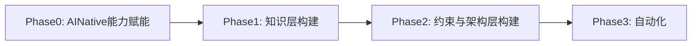

## 整体落地方案：

### Phase 0： AI Native能力赋能（让全组参与进来）
核心目标： 消除团队对新技术的陌生感，建立AI辅助工作的意识，确保全员有使用AI开发工具的核心技能，统一团队开发工作流。

#### 具体落地步骤
1. AI开发技能赋能
	- agent相关知识赋能，对agent是什么，能做什么，以及如何开发有认知
	- CLI工具核心功能：command，hook，SKILL，AGENT.md 关键功能赋能
	- 统一团队AI工作流，团队配置仓库，部署以及开发环境统一
2. 场景挖掘与初步尝试
	- 痛点收集： 收集开发过程中的痛点，尝试使用AI解决
3. 长久分享机制建立
	- 建立长久的成果分享以及技术分享机制
	- 建立自动化的成果推广机制

### 阶段里程碑

|---|---|

|AI Native技能赋能 | 开展相关技术培训，建立团队AI开发规范仓库，并完成AI Native开发测试|

|场景挖掘与初步尝试| 全员独自完成提出问题，到解决问题落地方案（AI） |

|长久分享机制建立| 落地自动化信息分享以及技术发布方案|

|**阶段周期：4月底 (1个月） **||

### Phase 1：摸底与知识体系搭建（让 Agent"看得懂" ）

核心目标：梳理存量资产，把散落在外部的团队知识、项目规则，沉淀到代码仓库中，让智能体可以准确理解现有项目的结构与规则。

#### 具体落地步骤

1. **存量模块资产盘点**

    - 梳理所有业务模块的职责、现有代码规模、依赖关系，输出模块依赖图谱
    - 识别出低风险、改动频繁的试点模块（优先选择工具类、用户中心等边界清晰的小模块）
    - 整理现有项目的技术栈、构建命令、测试命令等基础工程信息

  
2. **搭建最小化 Agent 知识地图（[AGENTS.md](AGENTS.md)）**

    - 在项目根目录创建`AGENTS.md`，严格控制在 100 行以内，只做 "导航地图"，不写百科全书
    - 内容结构：项目整体介绍 → 模块清单与职责 → 核心命令说明 → 详细信息的跳转指引
  

3. **结构化知识库迁移**
    - 创建`docs/`目录，按照主题分类存放所有项目知识：
        - `architecture.md`: 顶层架构说明
        - `module-rules.md`: 跨模块依赖规则
        - `design-docs/`  : 各模块的设计文档
        - `exec-plans/`   :  迭代计划与进度
        - api/                  :  所有模块对外提供服务API
        - database-info/ : 数据库表信息整理
    - 将原来散落在企业微信文档、wiki,聊天记录中的团队共识、历史约定，全部迁移到该目录下，做版本化管理

  
4. **试点模块最小验证**
    - 在试点模块内，尝试用智能体完成一个小任务（比如修复一个简单 Bug、添加一个小工具函数）
    - 验证智能体是否可以正确理解现有代码、找到对应的文档、完成符合规范的修改
    - 记录智能体犯的第一个错误，补充到 [AGENTS.md](AGENTS.md) 的规则中

#### 阶段里程碑

|里程碑项|验收标准|

|---|---|

|模块资产梳理完成|输出完整的模块依赖图谱，明确试点模块|

|知识地图落地|`AGENTS.md`完成，长度≤100 行，覆盖核心导航信息|

|知识库初始化|`docs/`目录搭建完成，完成试点模块的文档迁移|

|最小验证通过|试点模块完成首个 Agent 驱动的小任务，验证 Agent 可读懂现有代码|

|**阶段周期：5月底 **||

---
### Phase 2：架构约束与规则硬化（让 Agent"守规矩" 地开发）

核心目标：把原来的口头规范、文档规则，变成可机械强制执行的硬约束，避免智能体在高速开发中导致架构漂移、依赖混乱。

#### 具体落地步骤
1. **模块内分层规则适配**
    - 统一所有模块的分层标准，对齐clean code 的分层模型：`model → logic → api`
    - 规则：每个模块内，代码只能 "向前" 依赖，禁止反向依赖（比如 logic 不能直接修改 model，api 不能直接调用 Repo）
    - 梳理存量代码的违规点，做临时标记，在后续迭代中逐步重构，不一次性改造存量代码

1. **跨模块依赖边界定义**

    - 针对单机多模块的特点，定义跨模块的依赖规则：
        - 禁止循环依赖（A 依赖 B，B 又依赖 A）
        - 禁止跨模块的跨层调用（比如 A 模块的 UI 不能直接调用 B 模块的 Repo）
        - 横切关注点（认证、日志、监控）只能通过统一的 Providers 模块接入，不能散落在业务模块中
 
3. **自定义 Linter 与 CI 规则落地**
    - 开发自定义 Linter 规则，把上面的架构约束、编码规范，变成可自动检查的逻辑：
        - 模块内分层依赖检查
        - 跨模块依赖规则检查
        - 命名规范、文件大小限制、结构化日志检查
        - 物模型规范校验-字段规范
    - 错误信息中直接附带修复指引，让智能体看到错误就能自行修复
    - 将这些检查集成到 CI 流水线中，先以警告模式运行，逐步切换为错误模式，不影响现有业务

3. **规则迭代与试点推广**
    - 在试点模块内，严格执行 "零手写代码" 纪律：所有修改都通过智能体完成。
    - 每次智能体犯错，就把这个错误转化为规则：先补充到 [AGENTS.md](AGENTS.md)，然后逐步升级为 Linter 检查，实现 "犯一次错，永久修复"
    - 试点验证通过后，将规则逐步推广到其他模块

#### 阶段里程碑

|里程碑项|验收标准|

|---|---|

|分层规则对齐|完成所有模块的分层定义，梳理出存量违规点|

|依赖边界硬化|跨模块依赖规则落地，禁止循环 / 反向依赖|

|自动化检查上线|自定义架构 Linter 完成，CI 集成所有规则检查|

|试点效率提升|试点模块实现 Agent 自主 PR，人工审查量下降 50%|

|**阶段周期：7月（3月） **||

---

  

### Phase 3：自动化闭环与规模化（让 Agent"自己管自己"）

核心目标：搭建完整的反馈闭环，让智能体可以自主完成需求到合并的全流程，同时建立熵管理机制，避免代码库随着时间混乱腐烂。

#### 具体落地步骤
1. **搭建 Agent 自验证环境**
    - 适配 Git Worktree 机制，让智能体可以为每次修改启动独立的临时环境，不污染主开发环境
    - 接入可观测性堆栈，让智能体可以自助查询日志、指标，自行验证功能是否正常
    - 针对前端模块，接入 Chrome DevTools 协议，让智能体可以自行操作 UI、验证界面行为

1. **熵管理与垃圾回收机制**

    - 部署后台 "清理 Agent"，定期运行：
        - 文档新鲜度检查：扫描过时文档，自动发起修复 PR
        - 代码一致性检查：扫描不符合规范的代码，发起重构 PR
        - 死代码清理：清理无用的依赖、废弃的函数
    - 这些小 PR 只要 CI 通过就自动合并，相当于代码库的 "垃圾回收"，持续偿还技术债务

1. **全模块规模化推广**
2. 
    - 将试点模块的成功经验，逐步推广到所有业务模块
    - 调整 PR 合并策略：减少阻塞门，偶发的测试失败自动重跑，适配智能体的高吞吐量
    - 把大部分代码审查工作，转化为智能体对智能体的审查，人工只负责需要业务判断的部分

  

4. **持续迭代优化**

    - 建立每周 30 分钟的 Harness 回顾会，复盘智能体的高频错误，优化规则
    - 每两周运行一次 doc-gardening 任务，清理过时的规则和文档
    - 随着模型能力的升级，逐步淘汰过时的 Harness 组件，避免过度设计

  

#### 阶段里程碑

|里程碑项|验收标准|

|---|---|

|自验证闭环完成|Agent 可自助启动环境、运行测试、验证功能，无需人工介入|

|垃圾回收机制上线|后台清理 Agent 定时运行，自动修复文档 / 代码不一致问题|

|全模块覆盖|所有业务模块完成 Harness 改造，实现 Agent 驱动开发|

|效率规模化提升|团队人均日处理 PR 量提升至 3+，整体开发效率提升 10 倍|

|**阶段周期：10 月 （3个月）**||

---

  

